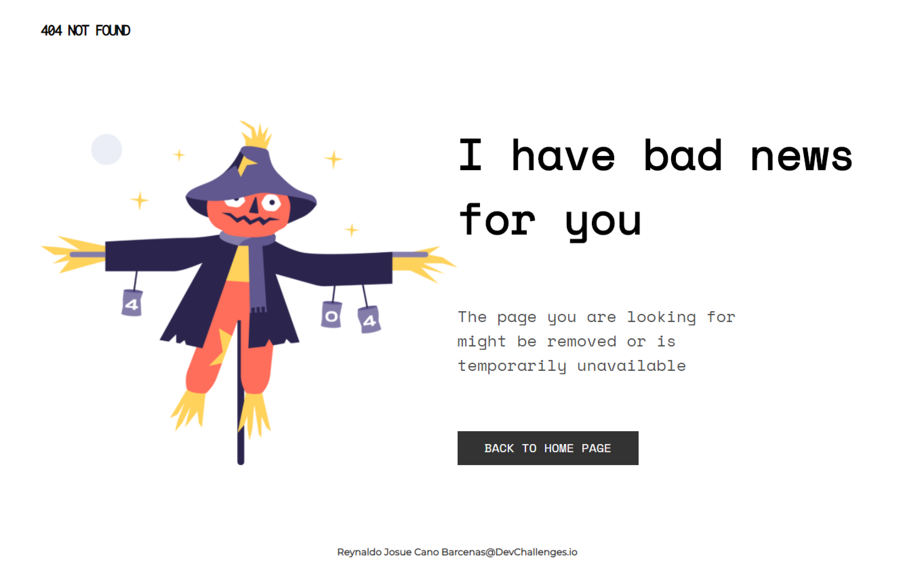

<!-- Please update value in the {}  -->

<h1 align="center">404 Not Found</h1>

   Solution for a challenge from  <a href="http://devchallenges.io" target="_blank">Devchallenges.io</a>.

  <h3>
    <a href="https://404-not-found-challange.netlify.app/">
      Demo
    </a>
     | 
    <a href="https://devchallenges.io/solutions/kTi4rcynOBBioE9sFmnR">
      Solution
    </a>
     | 
    <a href="https://devchallenges.io/challenges/wBunSb7FPrIepJZAg0sY">
      Challenge
    </a>
  </h3>

<!-- TABLE OF CONTENTS -->

## Table of Contents

- [Overview](#overview)
  - [Built With](#built-with)
- [Features](#features)
- [Contact](#contact)

<!-- OVERVIEW -->

## Overview

Hello there, this is my solution for the [challange 404 not found](https://devchallenges.io/challenges/wBunSb7FPrIepJZAg0sY):

- The demo of the solution can see it [here](http:google.com.ni)
- I enjoy solving this challenge, applying newly learned knowledge
- I apply Sass + Webpack to solve this challange

### Built With

<!-- This section should list any major frameworks that you built your project using. Here are a few examples.-->

- [Html](https://www.w3.org/html/)
- [Css](https://www.w3.org/Style/CSS/)
- [Sass](https://sass-lang.com/)
- [Webpack](https://webpack.js.org/)

## Features

<!-- List the features of your application or follow the template. Don't share the figma file here :) -->

This application/site was created as a submission to a [DevChallenges](https://devchallenges.io/challenges) challenge. The [challenge](https://devchallenges.io/challenges/wBunSb7FPrIepJZAg0sY) was to build an application to complete the given user stories.

## Contact

- GitHub [@roninJosue](https://github.com/roninJosue)
- Instagram [roninJosue](https://www.instagram.com/roninjosue)
